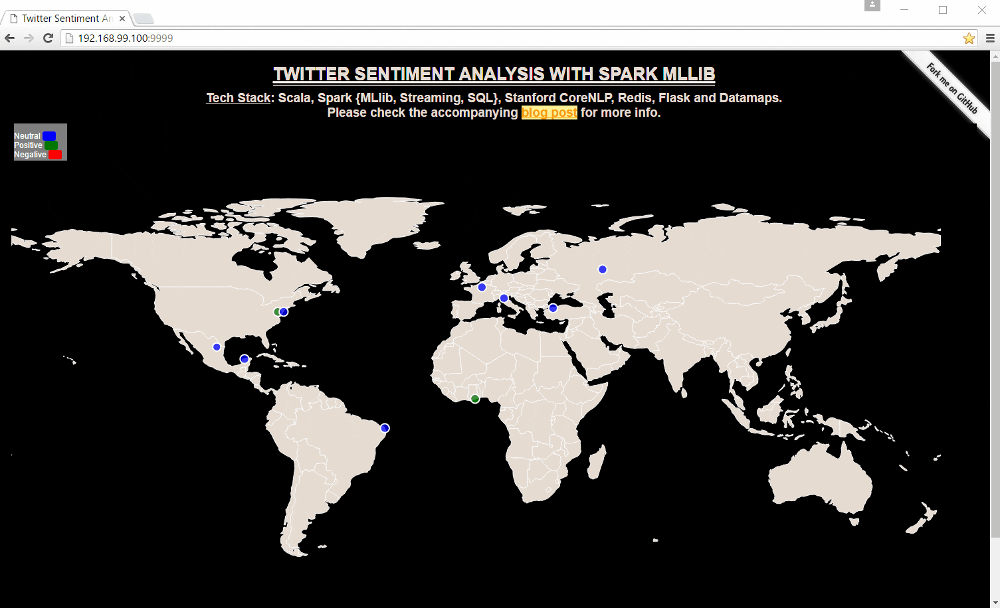
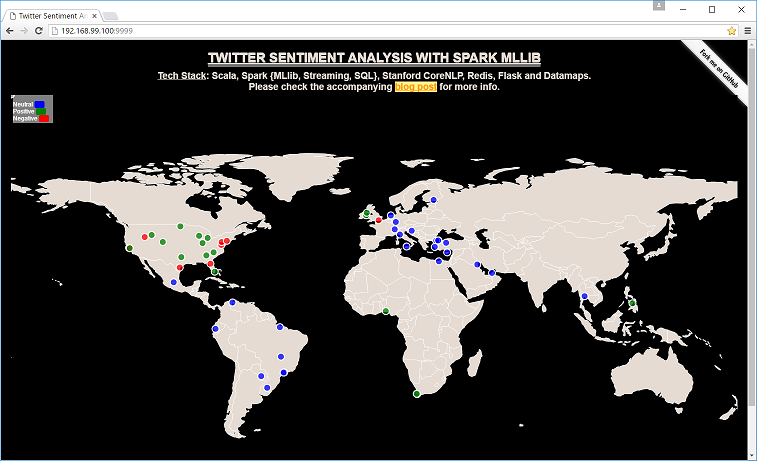
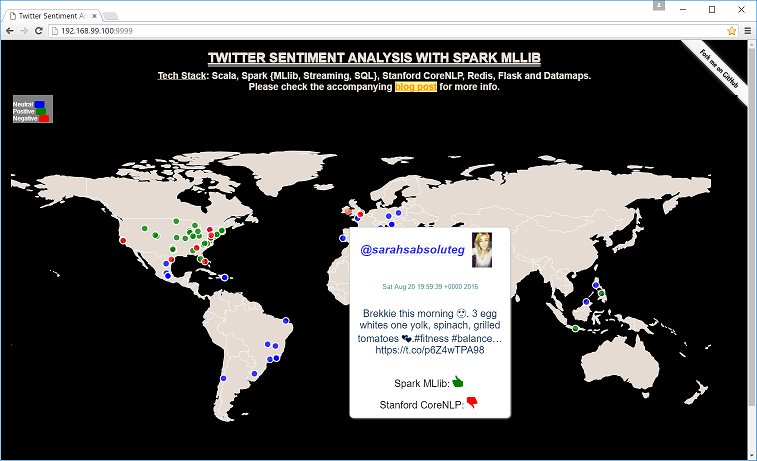
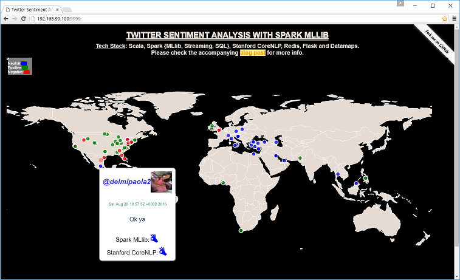
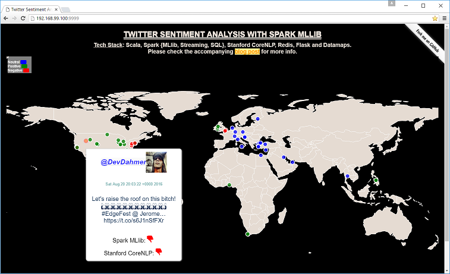
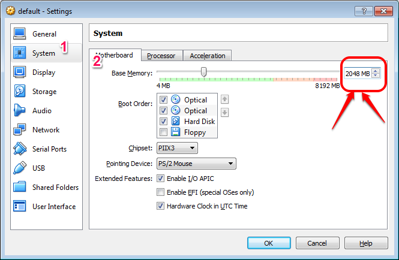
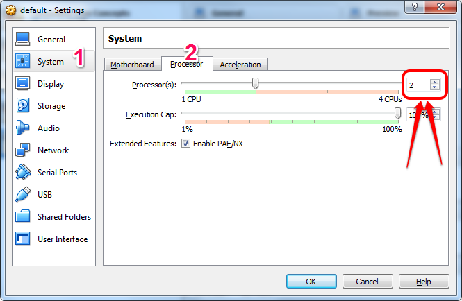

# Twitter sentiment analysis with Spark MLlib and visualization 

## Introduction
Project to analyse and visualize sentiment of tweets in real-time on a world map using Apache Spark ecosystem [Spark MLlib + Spark Streaming].

At a very high level, this project encapsulates and covers each of the following broad topics:

* Distributed Processing » Apache Spark
* Machine Learning » Naive Bayes Classifier [Apache Spark MLlib implementation]
* Visualization » Sentiment visualization on a World map using Datamaps
* DevOps » Docker Hub and Docker Image

For more details on this project and the code associated with it, please check this [blogpost](http://P7h.org/blog/2016/08/21/spark-twitter-sentiment/ "» P7h.org"). 
Also, a Docker Image is available on [Docker Hub](https://hub.docker.com/r/p7hb/p7hb-docker-mllib-twitter-sentiment "» Docker Hub URL for the image") with the complete environment and dependencies installed and preconfigured.

> #### Note:
I had actually written a blog post on my [personal website](http://P7h.org "» P7h.org") with the code walkthru and explaining intricate details; but unfortunately I managed to corrupt my Octopress GitHub repo. :anguished: :weary: :rage: So, till the time I salvage it, I thought of publishing it as [GitHub wiki](https://github.com/P7h/Spark-MLlib-Twitter-Sentiment-Analysis/wiki "» Blog post") for the time being.

## Visualization Demo and screenshots
### Demo of visualization

### Screenshots of visualization
#### Overview

#### Positive sentiment

#### Neutral sentiment

#### Negative sentiment

## Features
* Apache Spark MLlib's implementation of [Naive Bayes classifier](https://en.wikipedia.org/wiki/Naive_Bayes_classifier "» Wikipedia") is used for classifying the tweets in real-time.
* Training is performed using 1.6 million tweet training data made available by [Sentiment140](http://www.sentiment140.com/).
* Model created by Naive Bayes is applied in real-time to the tweets retrieved using Twitter Streaming API to determine the sentiment of each of the tweets.
* We also compare this result with Stanford CoreNLP sentiment prediction.
* Tweets are classified by both these approaches as:
	* Positive
	* Neutral
	* Negative
* Please note all non-English tweets are classified as "neutral" as our training data consists of English language only tweets.
* We analyze and process and consider only the tweets which have location and discard tweets without location info. 
	* This is to facilitate the visualization based on the latitude, longitude info of the tweets.
* Application can also save compressed raw tweets to the disk.
	* Please set `SAVE_RAW_TWEETS` flag to `true` in [`application.conf`](src/main/resources/application.conf#L30 "» code change required") if you want to save / retain the raw tweets we retrieve from Twitter.
* The result of the tweet is published to Redis which is subscribed by the front-end webapp for visualization.
* [Datamaps](https://datamaps.github.io/) -- based on [D3.js](https://d3js.org/) -- is used for visualization to display the tweet location on the world map with a pop up for more details on hover.
	* Hover over the bubbles to see the additional info of the tweets.
	* Visualization is fully responsive and scales well for any form factor. Works even on mobile.
	* App adjusts if a window is resized without impacting the UX or losing the data already on the screen.
	* Changes to the orientation [of a phone / tablet] does not have any impact on the app either.
* This codebase has been updated with comments, where necessary.

### Docker Image and Dockerfile
* Docker image hosted on [Docker Hub](https://hub.docker.com/r/p7hb/p7hb-docker-mllib-twitter-sentiment "Docker Hub URL for the image") is available with the complete environment and dependencies installed. 
* Dockerfile and other supporting files are also available on [GitHub](https://github.com/P7h/p7hb-docker-mllib-twitter-sentiment "» GitHub URL for code of the image").
* For detailed info on this project, please check the [blogpost](http://P7h.org/blog/2016/08/21/spark-twitter-sentiment/).

## Dependencies

Following is the complete list of languages and frameworks used and their significance in this project.

1. OpenJDK 64-Bit v1.8.0_102 » Java for compiling and execution; the VM to be precise
2. Scala v2.10.6 » basic infrastructure and Spark jobs
3. SBT v0.13.12 » build script and uber jar creation
4. Apache Spark v1.6.2
	* Spark Streaming » connecting to Twitter and streaming the tweets
	* Spark MLlib » creating a ML model and predicting the sentiment of tweets based on the text
	* Spark SQL » saving tweets [both raw and classified]
5. Stanford CoreNLP v3.6.0 » alternative approach to find sentiment of tweets based on the text
6. Redis » publishing classified tweets; subscribed by the front-end app to render the chart
7. Datamaps » chart and visualization
8. Python » run the flask app for rendering the front-end
9. Flask » render the template for front-end

Also, please check [`build.sbt`](build.sbt) for more information on the various other dependencies of the project.

## Prerequisites for successful execution

* A machine with Docker installed and in which you can allocate at least the following [actually the more, the merrier] to the Docker-machine instance:
	* 2 GB RAM
	* 2 CPUs
	* 6 GB free disk space
* We will need unfettered internet access for executing this project.
* Twitter App OAuth credentials are mandatory. 
	* These credentials are for retrieving tweets using Twitter Streaming API.
* We will download ~1.5 GB of data with this image and SBT dependencies, etc and streaming tweets too.

### Env Setup
If not already installed, please install [Docker](https://docs.docker.com/engine/installation/ "» Docker Installation steps") on your machine.

We will be using the accompanying [Docker image](https://hub.docker.com/r/p7hb/p7hb-docker-mllib-twitter-sentiment "» Docker image on Docker Hub") created for this project.

### Resources for the Docker machine
* Stop docker-machine. `docker-machine stop default`
* Launch VirtualBox and click on settings of `default` instance, which should be in `Powered Off` state.
* Fix the settings as highlighted in the screenshots below. 
	* Please note this is minimum required config; you might want to allocate more.
* Increase RAM of the VM 
	
* Increase # of CPUs of the VM 
	
* Relaunch docker after modifying the settings. `docker-machine start default`
* Any Docker image you create now will have 2 GB RAM and 2 CPUs allocated.
	* Or the resources you allocated earlier.

## Execution

### Run the Docker image
* This step will pull the Docker image from Docker Hub and runs it.
	* If the image doesn't exist locally, the Docker Client will first fetch the image from the registry and then run the image.
	* After image boots up and completes the setup process, you will land into a bash shell waiting for your input.

`docker run -ti -p 4040:4040 -p 8080:8080 -p 8081:8081 -p 9999:9999 -h spark --name=spark p7hb/p7hb-docker-mllib-twitter-sentiment:1.6.2`

Please note:

 * `root` is the user we logged into.
 * `spark` is the container name.
 * `spark` is host name of this container. 
 	* This is very important as Spark Slaves are started using this host name as the master.
 * The container exposes ports 4040, 8080, 8081 for Spark Web UI console and 9999 for Twitter sentiment Visualization.

### Twitter App OAuth credentials
* The only manual intervention required in this project is setting up a Twitter App and updating OAuth credentials to connect to Twitter Streaming API. Please note that this is a critical step and without this, Spark will not be able to connect to Twitter or retrieve tweets with Twitter Streaming API and so, the visualization will be empty basically without any data.
* Please check the [`application.conf`](src/main/resources/application.conf#L8-11) and add your own values and complete the integration of Twitter API to your application by looking at your values from [Twitter Developer Page](https://dev.twitter.com/apps).
	* If you did not create a Twitter App before, then please create a new Twitter App on [Twitter Developer Page](https://dev.twitter.com/apps), where you will get all the required values of `application.conf`.

### Execute Spark Streaming job for sentiment prediction
* Please execute [`/root/exec_spark_jobs.sh`](https://github.com/P7h/p7hb-docker-mllib-twitter-sentiment/blob/master/exec_spark_jobs.sh) in the console after updating the Twitter App OAuth credentials in `application.conf`.
	* This script first starts Spark services [Spark Master and Spark Slave] and then launches Spark jobs one after the other.
* This might take sometime as SBT will initiate a download and setup of all the required packages from Maven Central Repo and Typesafe repo as required.

### Visualization app
* After a few minutes of launching the Spark jobs, point your browser on the host machine to [`http://192.168.99.100:9999/`](http://192.168.99.100:9999/) to view the Twitter sentiment visualized on a world map. 
* When a tweet is classified, a small bubble appears on world map exactly showing the location from which that tweet originated from.
* Hovering over a bubble displays the corresponding tweet's additional info:
 1. tweet handle
 2. tweet profile pic
 3. date tweet created
 4. text of the tweet
 5. sentiment predicted by MLlib
 6. sentiment as per Stanford CoreNLP

## TODO
* Visualization could be completely scrapped for something better and UX needs a lot of uplifting.
* Use Spark package / wrapper for [Stanford CoreNLP](https://spark-packages.org/package/databricks/spark-corenlp "» Spark Packages official website") and reduce the boilerplate code further.
* Current prediction accuracy is ~80%. Prediction accuracy needs to be rethinked about and probably a better dataset should be used for creating the model.
* Update the project to Spark v2.0.
	* Push out RDDs; hello DataFrames and Datasets!
	* And also use `org.apache.spark.ml` package.
	* Also gain massive time due to many changes in the recent release of Apache Spark v2.0.
* Add or update comments in the code where necessary.
* Also processing and predicting non-English tweets too could be taken up in future.

## Expert mode execution steps
This is a very quick recap / summary of the steps required for execution of this code. 
Please consider these steps only if you are an expert on Docker, Spark and ecosystem of this project and understand clearly what is being done here.

* Install and launch Docker.
* Stop Docker and in the VirtualBox GUI, increase RAM of Docker machine [instance named `default` and should be in `Powered Off` state] to at least 2 GB [or more] and # of CPUs to 2 [or more].
* Start Docker again.
* Pull the project Docker image and launch it.
	* Might have to wait for ~10 minutes or so [depending on your internet speed]. 
	`docker run -ti -p 4040:4040 -p 8080:8080 -p 8081:8081 -p 9999:9999 -h spark --name=spark p7hb/p7hb-docker-mllib-twitter-sentiment:1.6.2`
* Update [`application.conf`](src/main/resources/application.conf#L8-11  "» config file change required") to include your Twitter App OAuth credentials.
* Execute: `/root/exec_spark_jobs.sh`
	* Might have to wait for ~10 minutes or so [depending on your internet speed].
* Point your browser on the host machine to [`http://192.168.99.100:9999`](http://192.168.99.100:9999 "» launch viz app") for visualization.

> #### Note:
Please do not forget to modify the Twitter App OAuth credentials in the file [`application.conf`](src/main/resources/application.conf#L8-11). 
Please check [Twitter Developer page](https://dev.twitter.com/apps "» create Twitter apps") for more info. 

## Helpful links
1. ~~I am currently hosting this web app on Amazon EC2: [http://54.84.252.184:9999/](http://54.84.252.184:9999/). I will bring it down sometime next week.~~ _Update on 19th September, 2016:_ After running the live app on EC2 for almost a month, I have shutdown this instance today.
2. Docker Image on Docker Hub Registry: [https://hub.docker.com/r/p7hb/p7hb-docker-mllib-twitter-sentiment/](https://hub.docker.com/r/p7hb/p7hb-docker-mllib-twitter-sentiment/).
3. GitHub URL for source code of the project: [https://github.com/P7h/Spark-MLlib-Twitter-Sentiment-Analysis](https://github.com/P7h/Spark-MLlib-Twitter-Sentiment-Analysis).
4. GitHub URL for blog post on code walkthru: [https://github.com/P7h/Spark-MLlib-Twitter-Sentiment-Analysis/wiki/](https://github.com/P7h/Spark-MLlib-Twitter-Sentiment-Analysis/wiki/).
5. Dockerfile GitHub repo: [https://github.com/P7h/p7hb-docker-mllib-twitter-sentiment](https://github.com/P7h/p7hb-docker-mllib-twitter-sentiment).

## Problems? Questions? Contributions? 
If you find any issues or would like to discuss further, please ping me on my Twitter handle [@P7h](http://twitter.com/P7h "» Twitter/@P7h") or drop me an [email](http://p7h.org/contact/ "» Contact me"). Appreciate your help. Thanks!

## License 
Copyright &copy; 2016 Prashanth Babu. 
Licensed under the [Apache License, Version 2.0](LICENSE).